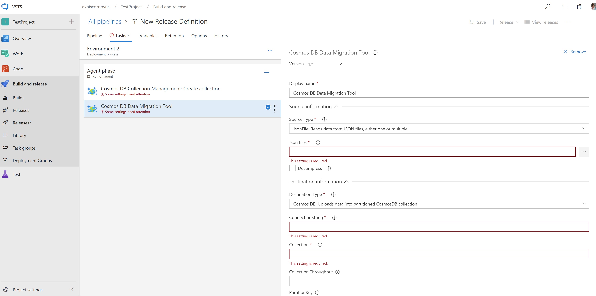
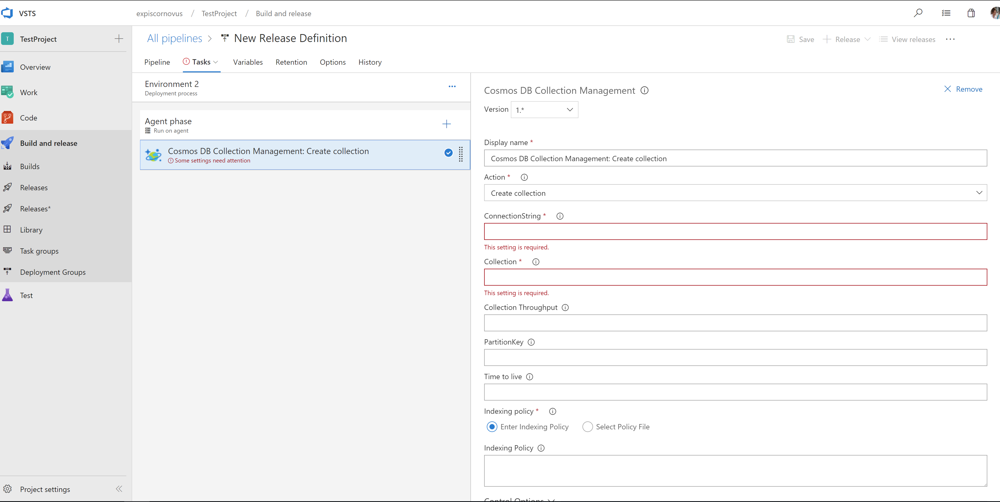

# Create or update Azure Cosmos DB collections and documents as part of your Release

Use VSTS's build/release management to manage your Azure Cosmos DB database collections. Currently the following features are available:
- Delete/Create/Update collections
- Import/Export data to/from Azure Cosmos DB 

This extension installs the following components
- **Cosmos DB Data Migration Tool:** A Build/Release task to run the Data Migration Tool. [Learn more](https://azure.microsoft.com/en-us/updates/documentdb-data-migration-tool/)
- **Cosmos DB Collection Management:** A Build/Release task to create/update your existing collection(s).

**Cosmos DB Data Migration Tool**

**Cosmos DB Collection Management**

## Release notes
* 1.0.0 - Initial release
* 1.0.9 - Added screenshots, fixed logging if no logging file name is specified
* 1.0.10 - Fixed issue with query escaping
* 1.0.15 - Added option to create the collection in the update collection action
* 1.0.17 - Updated data migration tool url

## Compatibility

Runs on Windows agents

## Contributing

Feel free to notify any issue in the issues section of the GitHub repository.
